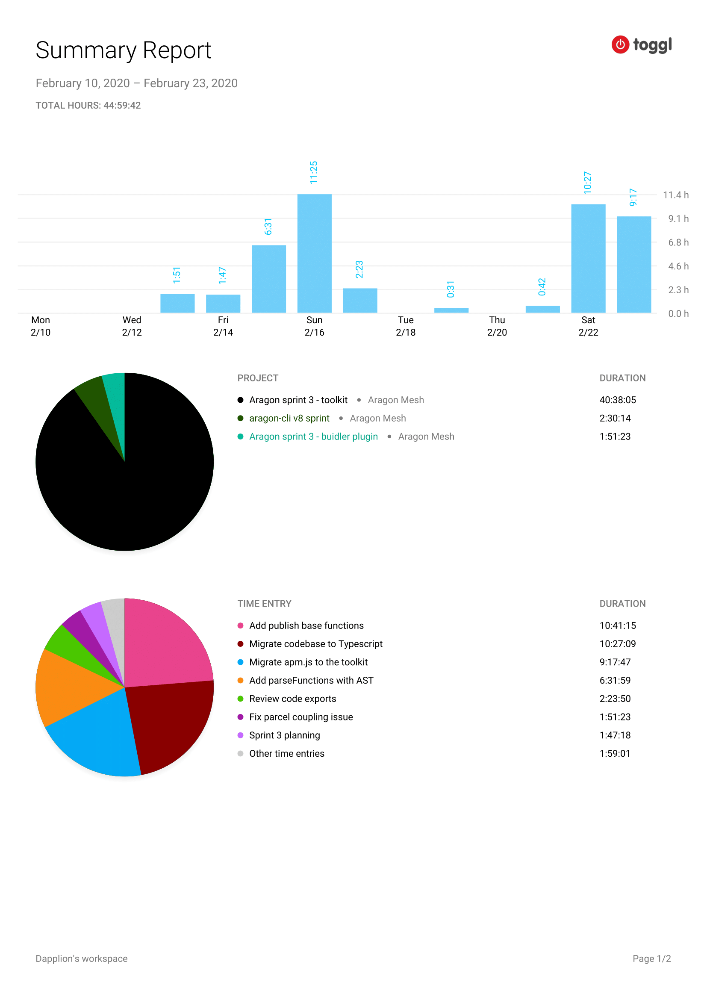

# Milestone 10

|       |                  |
| ----- | ---------------- |
| From  | 2019-02-24       |
| Until | 2020-03-08       |
| Hours | 33.3             |
| Asked | 1665 DAI @ 50/hr |
| Given | -                |

## References

## Description

Continued executing the vision of how publish should be handled in the toolkit and buidler plugin. Also, started working on a defined and clear API for the toolkit.

### Work in progress

2020-03-07 **aragon-cli** [#1542 Refactor toolkit API to have a single initializer](https://github.com/aragon/aragon-cli/pull/1542)

2020-02-29 **buidler-aragon** [#29 Use buidlerevm JSON RPC](https://github.com/aragon/buidler-aragon/pull/29)

2020-02-27 **aragon-cli** [#1517 Compile in the build stage and only lint in the lint stage](https://github.com/aragon/aragon-cli/pull/1517)

2020-02-26 **buidler-aragon** [#27 Develop review](https://github.com/aragon/buidler-aragon/pull/27)

### Opened these PRs

2020-02-29 **aragon-cli** [#1523 Fix Cherry pick parser branch nyc error](https://github.com/aragon/aragon-cli/pull/1523)

2020-02-29 **buidler-aragon** [#30 Publish task](https://github.com/aragon/buidler-aragon/pull/30)

2020-02-27 **aragon-cli** [#1515 Fix typing and import issues](https://github.com/aragon/aragon-cli/pull/1515)

2020-02-27 **aragon-cli** [#1516 Fix tests](https://github.com/aragon/aragon-cli/pull/1516)

### Tested/reviewed these PRs

2020-02-26 **buidler-aragon** [#26 Merge develop to master for release of 0.1.0](https://github.com/aragon/buidler-aragon/pull/26)

### Opened/discussed these issues

## Report

====
