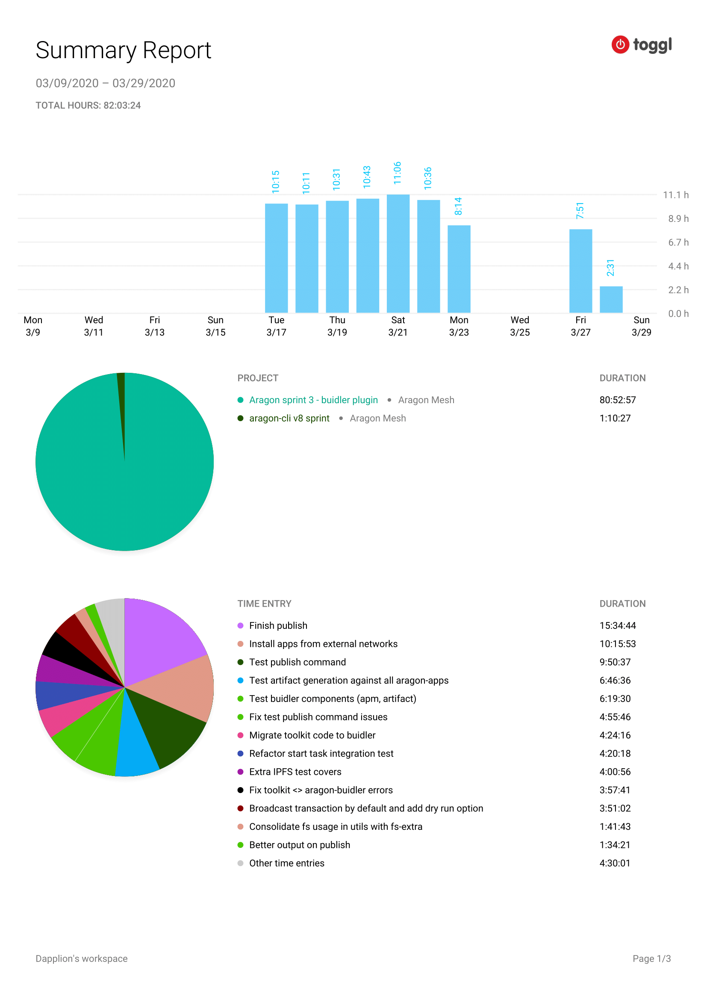

# Milestone 11

|       |                    |
| ----- | ------------------ |
| From  | 2020-03-09         |
| Until | 2020-03-29         |
| Hours | 82.05              |
| Asked | 4102.5 DAI @ 50/hr |
| Given | -                  |

## References

## Description

Complete remaining heavy lifting dev work to deliver a stable aragon-buidler plugin v0.2 release. The unfortunate forced stay at home situation has had the side effect of doubling my available time per week. Main items completed:

- Move all dev exclusive functionality from `@aragon/toolkit` to `buidler-aragon`
- Complete development of `buidler-aragon publish` task, to allow a full dev experience in the plugin
- Add and refactor tests to cover necessary cases in a stable manner, preventing false reds

### Work in progress

### Opened these PRs

2020-03-28 **buidler-aragon** [#89 Add extra publish test cases](https://github.com/aragon/buidler-aragon/pull/89)

2020-03-28 **buidler-aragon** [#90 Broadcast transaction by default and add dry run option](https://github.com/aragon/buidler-aragon/pull/90)

2020-03-28 **buidler-aragon** [#36 Install apps from external networks (dependencies)](https://github.com/aragon/buidler-aragon/pull/36)

2020-03-28 **buidler-aragon** [#1 Simplify getAbiFromContentUri](https://github.com/dapplion/buidler-aragon/pull/1)

2020-03-26 **buidler-aragon** [#81 Test publish task](https://github.com/aragon/buidler-aragon/pull/81)

2020-03-23 **buidler-aragon** [#74 Add publish task](https://github.com/aragon/buidler-aragon/pull/74)

2020-03-22 **buidler-aragon** [#76 Trigger on pull_request](https://github.com/aragon/buidler-aragon/pull/76)

2020-03-22 **buidler-aragon** [#79 Consolidate fs usage in utils with fs-extra](https://github.com/aragon/buidler-aragon/pull/79)

2020-03-22 **buidler-aragon** [#80 Test a more lightweight app in more stable manner](https://github.com/aragon/buidler-aragon/pull/80)

2020-03-20 **aragon-cli** [#1567 Remove blocking validation](https://github.com/aragon/aragon-cli/pull/1567)

2020-03-19 **buidler-aragon** [#40 Consolidate start and publish to have the same export format](https://github.com/aragon/buidler-aragon/pull/40)

2020-03-19 **aragon-cli** [#1562 Standardize exports to only use named exports](https://github.com/aragon/aragon-cli/pull/1562)

2020-03-19 **aragon-cli** [#1563 Generate type declaration files on toolkit build](https://github.com/aragon/aragon-cli/pull/1563)

2020-03-19 **aragon-cli** [#1542 Add common initializer argument to APM methods](https://github.com/aragon/aragon-cli/pull/1542)

2020-03-18 **buidler-aragon** [#38 Use stable toolkit version](https://github.com/aragon/buidler-aragon/pull/38)

2020-03-18 **buidler-aragon** [#39 Append defaults and arapp to buidler config](https://github.com/aragon/buidler-aragon/pull/39)

2020-03-18 **buidler-aragon** [#37 Change app](https://github.com/aragon/buidler-aragon/pull/37)

### Tested/reviewed these PRs

2020-03-30 **buidler-aragon** [#91 Refactor: Clean current artifact.json values](https://github.com/aragon/buidler-aragon/pull/91)

2020-03-22 **aragon-cli** [#1576 Add websocket over RPC url global option](https://github.com/aragon/aragon-cli/pull/1576)

2020-03-15 **aragon-cli** [#1543 26 check global variables](https://github.com/aragon/aragon-cli/pull/1543)

### Opened/discussed these issues

2020-03-22 **buidler-aragon** [#77 Release 0.2 stable](https://github.com/aragon/buidler-aragon/issues/77)

## Report

====
