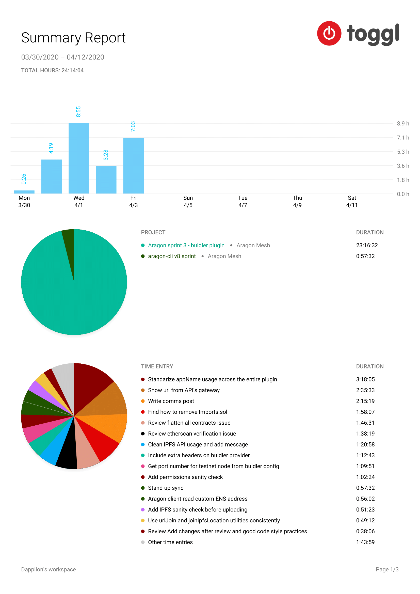

# Milestone 12

|       |                    |
| ----- | ------------------ |
| From  | 2020-03-30         |
| Until | 2020-04-12         |
| Hours | 24.23              |
| Asked | 1211.5 DAI @ 50/hr |
| Given | -                  |

## References

## Description

Finalized remaining issues and requiriments to successfully deliver the stable aragon-buidler plugin v0.2 release on April 3rd. Really happy of the outcome!

### Work in progress

---

2020-04-05 **buidler-aragon** [#121 Clean IPFS URL usage and force user to provide an API link](https://github.com/aragon/buidler-aragon/pull/121)

2020-04-04 **buidler-aragon** [#132 Add Github templates and scaffolding from CLI but re-worded](https://github.com/aragon/buidler-aragon/pull/132)

2020-04-03 **buidler-aragon** [#99 Assign to mnemonic settings to finalConfig](https://github.com/aragon/buidler-aragon/pull/99)

2020-04-03 **buidler-aragon** [#105 Sanity check root account exists](https://github.com/aragon/buidler-aragon/pull/105)

2020-04-03 **buidler-aragon** [#120 Standarize appName usage across the entire plugin](https://github.com/aragon/buidler-aragon/pull/120)

2020-04-03 **buidler-aragon** [#90 Broadcast transaction by default and add dry run option](https://github.com/aragon/buidler-aragon/pull/90)

2020-04-03 **buidler-aragon** [#111 Import external artifacts by path](https://github.com/aragon/buidler-aragon/pull/111)

2020-04-03 **buidler-aragon** [#128 Use urlJoin and joinIpfsLocation utilities consistently](https://github.com/aragon/buidler-aragon/pull/128)

2020-04-02 **buidler** [#502 Allow extra headers](https://github.com/nomiclabs/buidler/pull/502)

2020-04-02 **aragon** [#1376 Environment: Allow ENS_REGISTRY_ADDRESS customization for buidler-aragon](https://github.com/aragon/aragon/pull/1376)

2020-04-02 **buidler-aragon** [#110 Fix inconsistent types to provide IPFS info](https://github.com/aragon/buidler-aragon/pull/110)

2020-04-01 **buidler-aragon** [#97 Detect working IPFS gateway and use it for tx details](https://github.com/aragon/buidler-aragon/pull/97)

2020-04-01 **buidler-aragon** [#101 Add IPFS sanity check before uploading](https://github.com/aragon/buidler-aragon/pull/101)

2020-04-01 **buidler-aragon** [#102 Add permissions sanity check](https://github.com/aragon/buidler-aragon/pull/102)

2020-04-01 **buidler-aragon** [#105 Sanity check root account exists](https://github.com/aragon/buidler-aragon/pull/105)

2020-04-01 **buidler** [#501 Allow extra headers](https://github.com/nomiclabs/buidler/pull/501)

2020-04-01 **buidler** [#502 Allow extra headers](https://github.com/nomiclabs/buidler/pull/502)

2020-04-01 **buidler-aragon** [#106 Aragon does not provide an Kovan public node](https://github.com/aragon/buidler-aragon/pull/106)

2020-03-31 **buidler-aragon** [#96 Fix url joinning bug](https://github.com/aragon/buidler-aragon/pull/96)

2020-03-31 **buidler-aragon** [#1 Inject testnet port into the environment in the ganache test only](https://github.com/xuhcc/buidler-aragon/pull/1)

2020-03-31 **buidler-aragon** [#99 Assign to mnemonic settings to finalConfig](https://github.com/aragon/buidler-aragon/pull/99)

### Opened these PRs

### Tested/reviewed these PRs

2020-04-03 **buidler-aragon** [#115 Style: Add changes after review and good code style practices](https://github.com/aragon/buidler-aragon/pull/115)

2020-04-03 **buidler-aragon** [#93 Refactor: Use ethers namehash util](https://github.com/aragon/buidler-aragon/pull/93)

2020-04-03 **buidler-aragon** [#94 Feature: Add hooks logger](https://github.com/aragon/buidler-aragon/pull/94)

2020-04-03 **buidler-aragon** [#122 Small style name update](https://github.com/aragon/buidler-aragon/pull/122)

2020-04-03 **buidler-aragon** [#109 Use Aragon node as default ipfs gateway](https://github.com/aragon/buidler-aragon/pull/109)

2020-04-02 **buidler-aragon** [#108 Refactor: Split client logic outside of app front-end](https://github.com/aragon/buidler-aragon/pull/108)

2020-04-01 **buidler-aragon** [#91 Refactor: Clean current artifact.json values](https://github.com/aragon/buidler-aragon/pull/91)

2020-04-01 **buidler-aragon** [#82 Get port number for testnet node from buidler config](https://github.com/aragon/buidler-aragon/pull/82)

### Opened/discussed these issues

2020-04-05 **buidler-aragon** [#136 Nice to have features after v0.2.0](https://github.com/aragon/buidler-aragon/issues/136)

2020-04-03 **buidler-aragon** [#123 Configure prettierrc](https://github.com/aragon/buidler-aragon/issues/123)

2020-04-03 **buidler-aragon** [#131 Cosmetic issues](https://github.com/aragon/buidler-aragon/issues/131)

2020-04-01 **buidler-aragon** [#103 flatten includes Imports.sol](https://github.com/aragon/buidler-aragon/issues/103)

## Report

====
